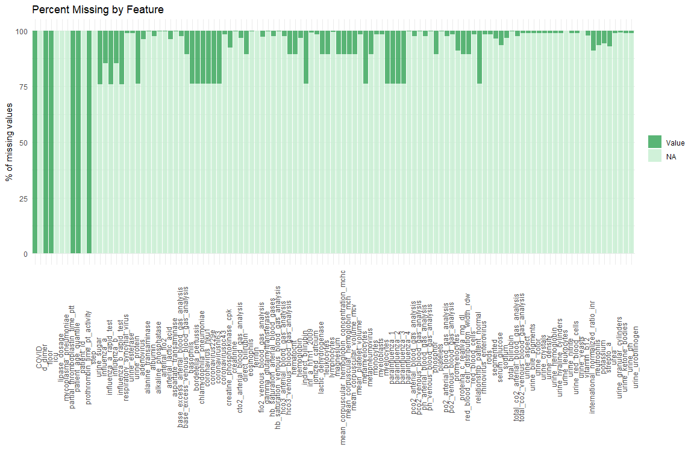
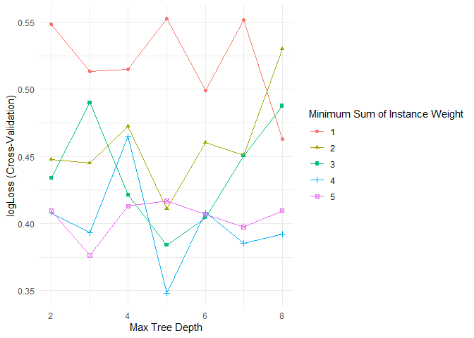
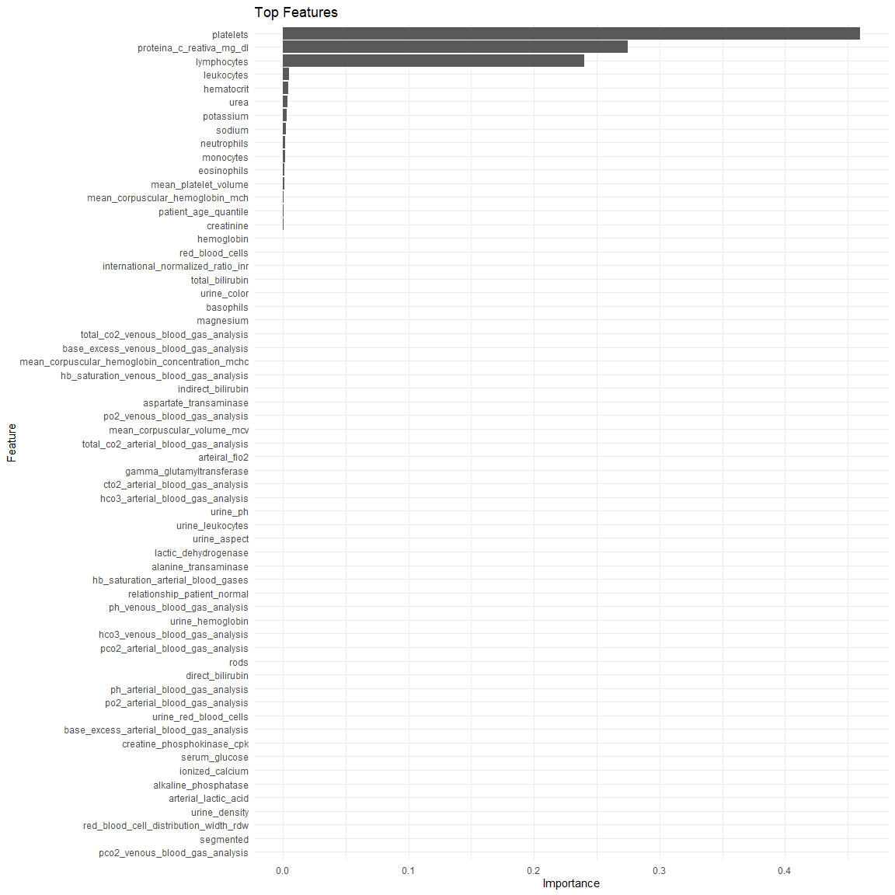
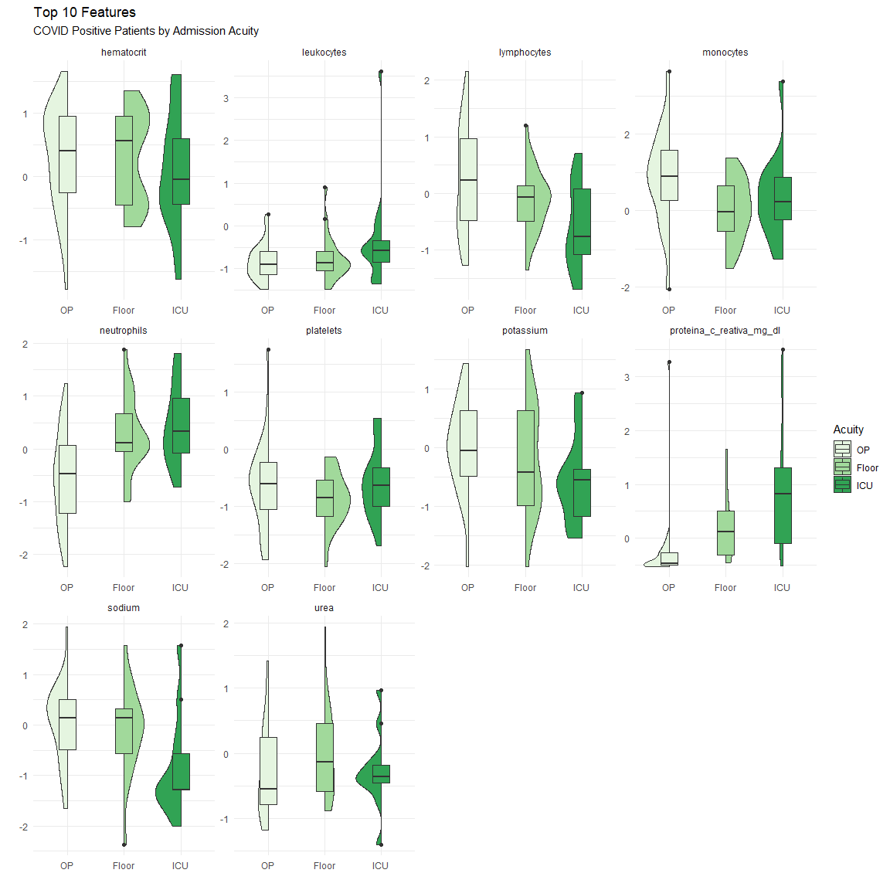
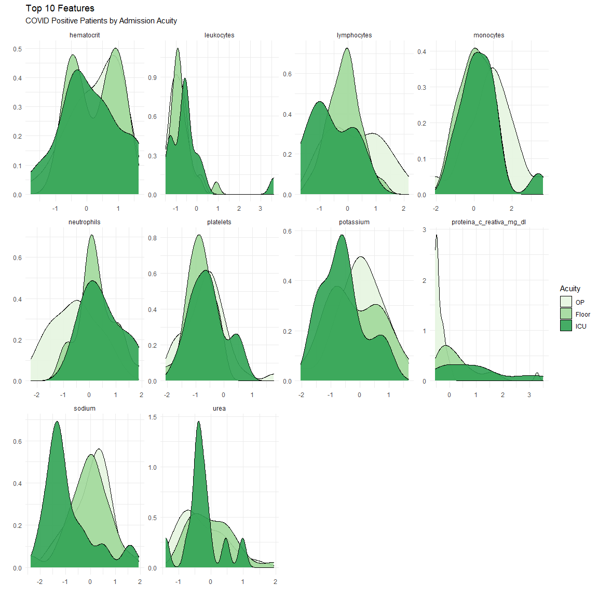
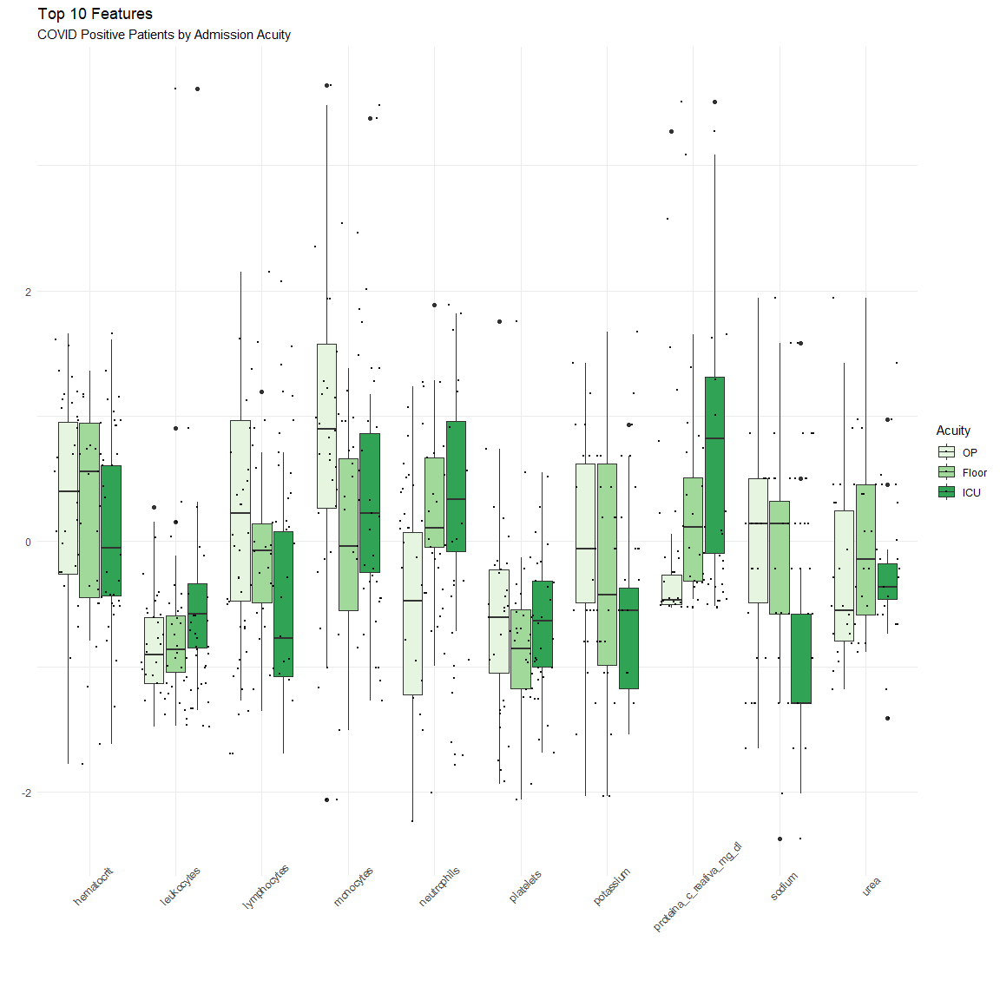
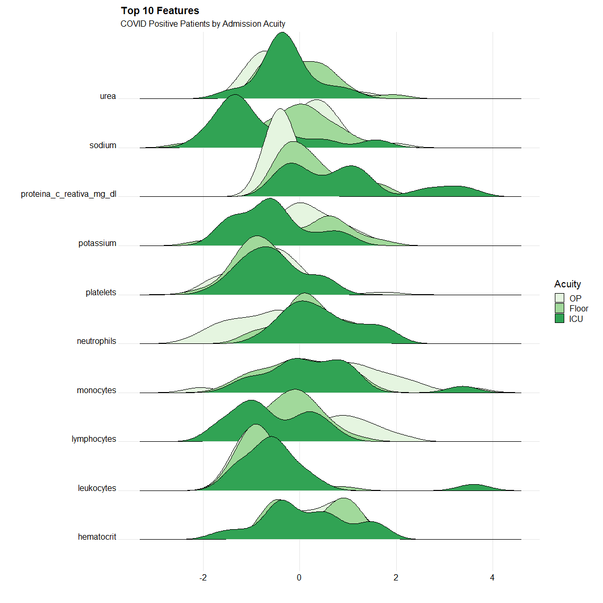

# COVID Severity

**Overview:** In this project my goal was to identify metabolic differences positive COVID-19 patients which might indicate increased acuity. It represents a step forward from my previous projects in code technique and extensibility, better data hygiene and elimination of data leakage, greater command of the Caret modeling process, and (still in process) more robust outcome evaluation.
<br>

**Highlights:**
*	Missing Data Visualizations.
*	No data leakage.

*	Introduction of the recipes package:
+	Removal of near zero, and zero variance predictors
+	Step integer ordinality encoding of nominal predictors
+	Center and Scaling
+	One-hot encoding

*	XGBoost:
+	Hyperparameter tuning using grid search.
+	Caret multi-class summary.
+	10-fold cross validation.
+	SMOTE subsampling for improved imbalanced classification.

*	Simulated Bias detection:
+	Pending: Evaluation of prediction across synthetic protected classes

<br>

**Outcome:** The resulting model was able to achieve acceptable accuracy owing to high sensitivity of the dominate class (Outpatient treatment patients). However, minority classification performance was poor, and the model failed to achieve statistical significance (Floor and ICU patients). I believe this to be a result of poor representation within subsamples, limited number of features, and limited nature of the data set. 

<br>

**Limitations / Analysis not performed:** 

*	As mentioned, patient demographic information was understandably absent. Bias metrics were calculated using synthetic data. 
*	Patients were only represented once within the dataset and did not contain any measure of movement throughout phases of care (no option for “time-to-event” predictions). 
*	A result of missing data and effort to avoid imputation of patient lab values the following methods were not used:
+	Principle component analysis 
+	Feature correlations
*	Evaluation of continuous variables using Restricted Cubic Splines
<br>


## About the Data

This dataset contains anonymized data from patients seen at the Hospital Israelita Albert Einstein, at São Paulo, Brazil, and who had samples collected to perform the SARS-CoV-2 RT-PCR and additional laboratory tests during a visit to the hospital. All data were anonymized following the best international practices and recommendations. All clinical data were standardized to have a mean of zero and a unit standard deviation. We aimed at including laboratory tests more commonly order during a visit to the emergency room


<br>

## Something is Missing {.tabset .tabset-fade}

Upon loading the data set you're immediately struck by the amount of missing values. Plotting the count of NA by feature we can better see the true extent. <br>


### Percent Missing by Feature


```
## `summarise()` regrouping output by 'col', 'total' (override with `.groups` argument)
```

<!-- -->

### Missing by Row

<!-- -->
<br>

### Admission Recoding

Many of the present values are the TRUE/FALSE patient admission status, with no overlap across acuity levels these will be recoded into a single admission column where floor (general ward) = 1, step (semi intensive care) and icu = 2, and no status is assumed to be outpatient (OP) = 0. 


```r
data$admission <- base::ifelse(data$floor == "TRUE", "1", 
                               base::ifelse(data$step == "TRUE", "2",
                                            base::ifelse(data$icu == "TRUE", "2", "0"))) %>% base::as.numeric()

# remove the old floor/step/icu columns, filter for covid positive patients only, then reorder the columns to put admission target first
positive <- data %>% 
              select(-floor, 
                     -step,
                     -icu,
                     -patient_id) %>%
              filter(COVID == "positive") %>%
              select(admission, 
                     everything())
```


<br>

## Recipies {.tabset .tabset-fade}

Then we evaluate non-numeric columns for ordinal features. While many are simply boolean values (ie detected / not_detected) urine micro results represent an ordinal condition (such as aspect: clear, lightly cloudy, cloudy) must be recoded. <br>

This is where we'll introduce the recipes package to create integer features, drop our zero and near zero variance variables and stratify the training set based off the target "admission" variable. Given the poor distribution of the target variable, we'll use a subsampling technique during our training process. <br>

<br>

### Split


```r
# Selecting non numeric columns into a df, looking for features which may have ordinality
nominal <- positive %>% dplyr::select_if(~!is.numeric(.x))

# Create Training and Testing Set: because there are 506 unclassified admissions and 52 positive cases, we'll use the stratify feature of the recipes package to ensure that our target variable is distributed evenly across 70/30 split training and testing subsets

table(positive$admission) %>% prop.table()
```

```
## 
##          0          1          2 
## 0.90681004 0.06451613 0.02867384
```

```r
set.seed(333)
split  <- initial_split(positive, 
                        prop = 0.7, 
                        strata = "admission")

train  <- training(split)
test   <- testing(split)

# The result is a proportionally distributed target variable in our training split
table(train$admission) %>% prop.table()
```

```
## 
##          0          1          2 
## 0.90025575 0.06649616 0.03324808
```

```r
table(test$admission) %>% prop.table()
```

```
## 
##          0          1          2 
## 0.92215569 0.05988024 0.01796407
```
<br>

### Designing "DNA" with Recipies

Building our recipes DNA to perform the following steps: <br>
- Remove zero and near zero variance variables <br>
- Create ordinal integers for specified nominal columns <br>
- Center and scale all numeric variables (which may have already been performed on the original data set but wont hurt) <br>
- One-hot encode remaining nominal features <br>
- Once the recipe is created, we prep the sample to estimate the outcome, then bake our training and test samples. <br>
- The preped mRNA then processes ("pro") the training set to create the protrain df... protrain... like protein, get it? Cause the mRNA...<br>

Next steps will be to build this directly into my caret training process, but I ran into issues when evaluating the prediction. <br>


```r
# specify admission as an outcome column
dna <- recipe(admission ~ ., data = positive) %>%
   step_nzv(all_predictors())  %>%
   step_integer(matches("urine_color|urine_aspect|urine_hemoglobin|urine_leukocytes")) %>%
   step_center(all_numeric(), -all_outcomes()) %>%
   step_scale(all_numeric(), -all_outcomes()) %>%
   step_dummy(all_nominal(), one_hot = TRUE)
 
mrna <- prep(dna, training = train)

# pro = processed, resulting in "pro-train", like protein, get it?
protrain <- bake(mrna, new_data = train)
protest <- bake(mrna, new_data = test)
```

<br>

## XGBoost with Caret {.tabset .tabset-fade}

  Using XGBoost for its ability to handle and incorporate missing values. Given that we're working with primarily patient medical lab data, it would be inappropriate to impute missing values. This precludes us from being able to evaluate for highly correlated features, with non-boosted tree models (random forest) this could cause correlated features which are otherwise strong predictors to be under represented in the resulting ensemble. With XGBoost if two predictors are perfectly correlated the descent gradient cost function will essentially "pick one" and carry it forward for the remaining ensembles. We wont know if this happens without calculating correlations, but the main impact would be in our data storytelling. <br> 


<br>

### Tuning + SMOTE

Setting up our Tuning grid to find best performing hyperparameters. Using the Caret train function to perform 10-fold cross validation with multiclass summary. To better accommodate our imbalanced classification, we're using the hybrid subsampling method SMOTE (synthetic Minority Over Sampling Technique) performed within each cross validation subset. 


```r
xgb_grid = expand.grid(
                  nrounds = 1000,
                  eta = c(0.1), #0.05, 0.01), # limited for processing brevity
                  max_depth = c(2, 3, 4, 5, 6, 7, 8),
                  gamma = 0,
                  colsample_bytree=1,
                  min_child_weight=c(1, 2, 3, 4 ,5),
                  subsample=1)

control <- trainControl(method ="cv", 
                        number = 10,
                        classProbs = TRUE, 
                        summaryFunction = multiClassSummary,
                        sampling = "smote")


set.seed(333)
xgb_caret <- train(x=X_train, 
                   y=Y_train_char$Y_train, 
                   method ='xgbTree',
                   metric ="logLoss",
                   nthreads = 6,
                   trControl = control,
                   tuneGrid = xgb_grid
                   ) 

# Best tune parameters from hyper parameter grid search
#xgb_caret$results
xgb_caret$bestTune
```

```
##    nrounds max_depth eta gamma colsample_bytree min_child_weight subsample
## 19    1000         5 0.1     0                1                4         1
```

<br>

### Design

<!-- -->

<br>

### Performance


```
## Confusion Matrix and Statistics
## 
##           Reference
## Prediction  OP Floor ICU
##      OP    145     3   0
##      Floor   0     0   0
##      ICU     9     7   3
## 
## Overall Statistics
##                                          
##                Accuracy : 0.8862         
##                  95% CI : (0.828, 0.9301)
##     No Information Rate : 0.9222         
##     P-Value [Acc > NIR] : 0.9637324      
##                                          
##                   Kappa : 0.3704         
##                                          
##  Mcnemar's Test P-Value : 0.0002734      
## 
## Statistics by Class:
## 
##                      Class: OP Class: Floor Class: ICU
## Sensitivity             0.9416      0.00000    1.00000
## Specificity             0.7692      1.00000    0.90244
## Pos Pred Value          0.9797          NaN    0.15789
## Neg Pred Value          0.5263      0.94012    1.00000
## Prevalence              0.9222      0.05988    0.01796
## Detection Rate          0.8683      0.00000    0.01796
## Detection Prevalence    0.8862      0.00000    0.11377
## Balanced Accuracy       0.8554      0.50000    0.95122
```

<br>

### Feature Importance


<!-- -->

<br>


<br>

## Feature Exploration {.tabset .tabset-fade}

<br>

### Violin 

<!-- -->

<br>

### Density 

<!-- -->
<br>

### Box and Jitter 

<!-- -->

<br>

### Ridge


```
## Picking joint bandwidth of 0.316
```

<!-- -->


